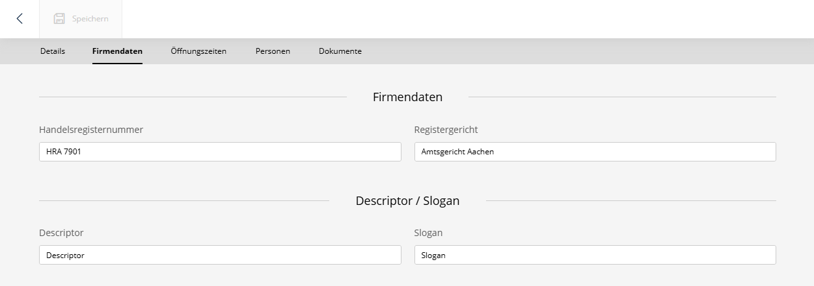
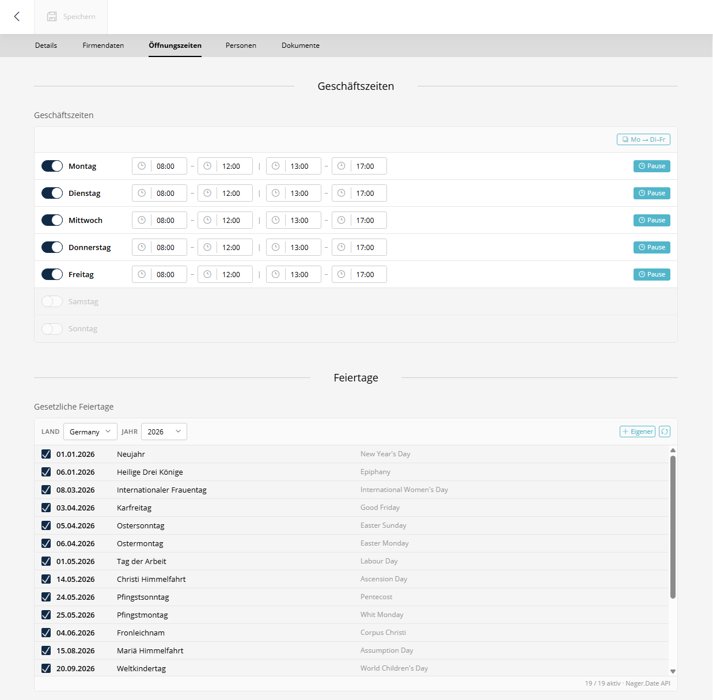

# SuluExtendedAccountBundle


[](https://github.com/manuxi/SuluExtendedAccountBundle/LICENSE)


Ein Sulu-Bundle zur Erweiterung der Account-Entität um Firmendaten, Geschäftszeiten, gesetzliche Feiertage und Betriebsferien.





[🇬🇧 English](README.md) | **Deutsch**

## Dokumentation

- [Installation](docs/installation.de.md)
- [Features](docs/features.de.md)

## Schnellstart

```console
composer require manuxi/sulu-extended-account-bundle
```

Falls Symfony Flex **nicht** verwendet wird, muss das Bundle in der `config/bundles.php` registriert werden:

```php
return [
    //...
    Manuxi\SuluExtendedAccountBundle\SuluExtendedAccountBundle::class => ['all' => true],
];
```

Admin-Routen in der `config/routes/routes_admin.yaml` eintragen:

```yaml
SuluExtendedAccountBundle:
    resource: '@SuluExtendedAccountBundle/Resources/config/routes_admin.yaml'
```

Datenbankschema aktualisieren:

```console
php bin/console doctrine:schema:update --force
```

Detaillierte Anweisungen finden sich in der [Installationsanleitung](docs/installation.de.md).

## Abhängigkeiten

Dieses Bundle benötigt das [SuluAdminExtrasBundle](https://github.com/manuxi/SuluAdminExtrasBundle) für die Content Types `business_hours`, `public_holidays` und `holiday_dates`.

## Twig-Funktionen

Das Bundle stellt Twig-Funktionen für die Frontend-Ausgabe bereit:

| Funktion | Rückgabe | Beschreibung |
|----------|----------|--------------|
| `is_open_now(accountId)` | `bool` | Ob der Account gerade geöffnet ist |
| `get_business_hours(accountId)` | `array` | Vollständiger Wochenplan |
| `get_today_hours(accountId)` | `array\|null` | Heutige Öffnungszeiten |
| `is_holiday(accountId)` | `bool` | Ob heute ein Feiertag ist |

Siehe [Funktionen](docs/features.de.md) für Anwendungsbeispiele.

## Konfiguration

Aktuell ist keine Konfiguration erforderlich.

## Mitwirken

Issues und Pull Requests sind willkommen. Feedback zur Verbesserung des Bundles ist jederzeit erwünscht.

## Lizenz

Dieses Bundle wird unter der [MIT-Lizenz](LICENSE) veröffentlicht.