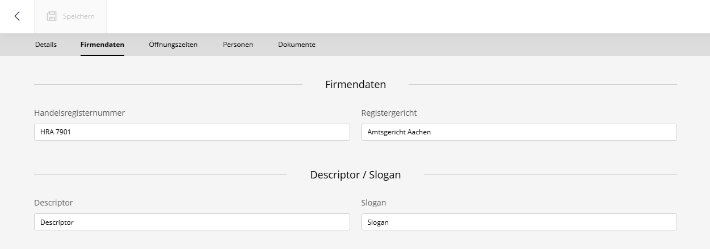
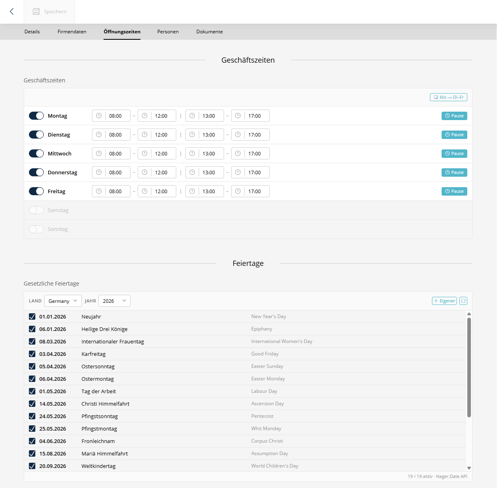

# SuluExtendedAccountBundle


[](https://github.com/manuxi/SuluExtendedAccountBundle/LICENSE)


**English** | [🇩🇪 Deutsch](README.de.md)

A Sulu bundle to extend the account entity with company data, business hours, public holidays and company holidays.

> **Note:** This bundle replaces the former `manuxi/sulu-additional-account-data-bundle` (`SuluAdditionalAccountDataBundle`).





## 📋 Prerequisites

- PHP 8.2 or higher
- Sulu CMS 3.0 or higher
- Symfony 6.2 / 7.0 or higher
- [SuluAdminExtrasBundle](https://github.com/manuxi/SuluAdminExtrasBundle) (installed automatically as a dependency)

## 👩🏻‍🏭 Installation

### Step 1: Install the package

```bash
composer require manuxi/sulu-extended-account-bundle
```

If you are **not** using Symfony Flex, register the bundle in `config/bundles.php`:

```php
return [
    //...
    Manuxi\SuluExtendedAccountBundle\SuluExtendedAccountBundle::class => ['all' => true],
];
```

### Step 2: Configure routing

Add the following to `config/routes/routes_admin.yaml`:

```yaml
SuluExtendedAccountBundle:
    resource: '@SuluExtendedAccountBundle/Resources/config/routes_admin.yaml'
```

### Step 3: Update database schema

```bash
# Preview the required SQL changes
php bin/console doctrine:schema:update --dump-sql

# Apply the changes
php bin/console doctrine:schema:update --force
```

> **Important:** Make sure you only process the schema updates related to this bundle.

### Step 4: Admin assets setup

The opening hours features (business hours, public holidays, company holidays) use content types from the **SuluAdminExtrasBundle**. Their JavaScript components must be registered in your admin assets.

**A) Update `assets/admin/package.json`**

Add the dependency for the AdminExtrasBundle:

```json
{
    "dependencies": {
        "sulu-admin-extras-bundle": "file:../../vendor/manuxi/sulu-admin-extras-bundle/src/Resources"
    }
}
```

**B) Update `assets/admin/app.js`**

Import the bundle:

```javascript
import 'sulu-admin-extras-bundle';
```

**C) Install & Build**

```bash
cd assets/admin
npm install
npm run build
```

For detailed instructions see the [Installation Guide](docs/installation.md).

## ✨ Features

### Company Data
- Commercial register number, registry court, descriptor and claim

### Opening Hours
- Weekly business hours schedule with time slots and breaks
- Public holidays via Nager.Date API integration
- Company holidays / closure periods

### Twig Functions
The bundle provides Twig functions for frontend use:

| Function | Returns | Description |
|----------|---------|-------------|
| `is_open_now(accountId)` | `bool` | Whether the account is currently open |
| `get_business_hours(accountId)` | `array` | Full weekly schedule |
| `get_today_hours(accountId)` | `array\|null` | Today's hours |
| `is_holiday(accountId)` | `bool` | Whether today is a holiday |

See [Features](docs/features.md) for usage examples.

## 📖 Documentation

Detailed documentation in the [docs/](docs/) directory:

- [Installation](docs/installation.md) - Full installation guide
- [Features](docs/features.md) - Feature overview and Twig usage examples

## 🧶 Configuration

No additional configuration is required at this time.

## 👩‍🍳 Contributing

Contributions are welcome! Please create issues or pull requests. Feedback to improve the bundle is always welcome.

## 📝 License

This bundle is released under the [MIT License](LICENSE).

## 🎉 Credits

Created and maintained by [manuxi](https://github.com/manuxi).

Thanks to the Sulu team for the great CMS and the fantastic support!
